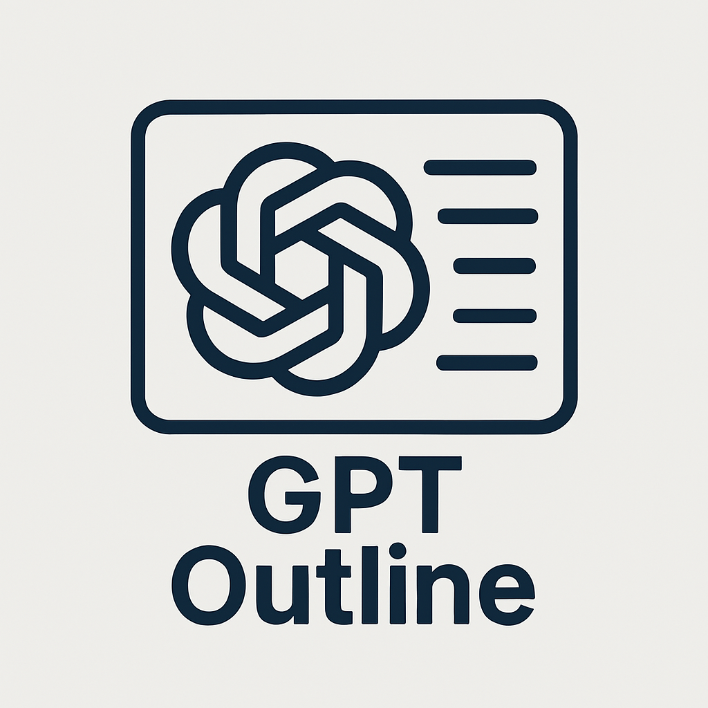
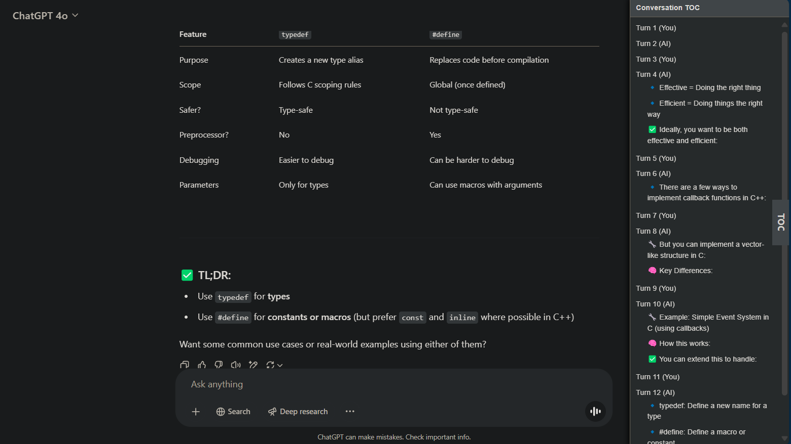

#

# ChatGPT Table of Contents Extension

This Chrome extension adds a dynamic Table of Contents (TOC) panel to ChatGPT conversations, allowing users to easily navigate between turns and AI responses. It helps you keep track of longer conversations by organizing them into clickable sections.

## 🚀 Features

- Automatically detects and lists all conversation turns.
- Differentiates between user input and ChatGPT responses.
- Adds sub-sections for each `h3` header in AI responses (excluding those inside code blocks).
- Smooth scrolling to selected conversation parts.
- Dark mode support.
- Toggle panel visibility with a floating TOC handle.

## 📷 Preview

## 🛠️ Installation

1. Clone or download this repository and unzip the folder.
2. Open Chrome and navigate to `chrome://extensions/`.
3. Enable **Developer mode** (toggle switch in the top right).
4. Click **Load unpacked** and select the extension folder.
5. Visit [ChatGPT](https://chat.openai.com/) and start a conversation. The TOC will appear automatically.

  

## 🧠 How It Works

The extension injects a content script (`content.js`) into ChatGPT’s website. It scans the DOM for conversation turns using the selector `article[data-testid^='conversation-turn-']`, then builds a sidebar listing each turn with nested sections for headings found in AI responses.

A MutationObserver watches for DOM updates (new messages) and updates the TOC in real-time.

## 🔗 Reference

This extension is based on a bookmarklet script created by [Kevin Brostoff](https://gist.github.com/Brostoffed/cbe33856cb1beb5f1c3852b9b5625204). All credits for the original TOC logic go to the author.

## 📄 License

This project is open source under the [MIT License](LICENSE). Please include attribution if you modify or redistribute.

